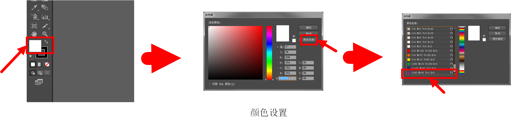

#SVG_Tutorial

>[ZhiLI](https://github.com/lizhipower)
>lizhipower@gmail.com

##Getting started

Scalable Vector Graphics, SVG, is a W3C XML dialect to mark up graphics. It is partially implemented in Firefox, Opera, WebKit browsers, Internet Explorer and other browsers.

* SVG 指可伸缩矢量图形 (Scalable Vector Graphics)
* SVG 用来定义用于网络的基于矢量的图形
* SVG 使用 XML 格式定义图形
* SVG 图像在放大或改变尺寸的情况下其图形质量不会有所损失
* SVG 是万维网联盟的标准
* SVG 与诸如 DOM 和 XSL 之类的 W3C 标准是一个整体

##Intruction

* **矩形 `<rect>`**
* **圆形 `<circle>`**
* 椭圆 `<ellipse>`
* 线 `<line>`
* 折线 `<polyline>`
* 多边形 `<polygon>`
* **路径 `<path>`**

##Demo

    <svg>
        <rect id='rectId' class='rectClass' name='rectName' width="300" height="100"
              style="fill:rgb(0,0,255);"></rect>
    </svg>

in HTML you will get a [recangle](.\src\svgTutorial.svg).

##SVG and HTML

    document.getElementById('Id_Of_Obeject')

In HTML the elements should be assigned with atrributes like id, class, name etc. So SVG with out id is horrible. Unfortunately, in NingBo Project, we have none of them.

##How assign SVG with id

1. edit the code

2. Adobe Illustrator

##Reference

[**W3School**](http://www.w3school.com.cn/svg/)W3School关于SVG的教程

[**SVG | MDN**](https://developer.mozilla.org/zh-CN/docs/Web/SVG/Tutorial)mozilla关于SVG的教程

[**仓库:**](https://github.com/lizhipower/WebTutorial)我们的大部分的参考资料会发布在这里，比如大家可以看到SVG文件夹下的我整理的一些资料，也是这篇文档的所在位置。

同时大家可以在w3school看到关于web开发的大部分在线资料，希望有兴趣的看一看：[html](http://www.w3school.com.cn/h.asp)、[javascript](http://www.w3school.com.cn/b.asp)、[jquery](http://www.w3school.com.cn/jquery/index.asp)。

特别的，如果今后要从事前端开发的请理解：[AJAX](http://www.w3school.com.cn/ajax/index.asp)、[json](http://www.w3school.com.cn/json/index.asp)、[**DOM**](http://www.w3school.com.cn/htmldom/index.asp)。

#注意事项

##分工

建议各位在12.29之前完成，谢谢！

姓名|任务|完成情况
:---:|:---:|:---:
刚哥|nb市区潮流图.ln.svg|[to do]
熊哥|nb市区东潮流图.ln.svg|[to do]
焦昊|nb慈溪片.ln.svg && nb宁奉象.ln.svg|[done]
楼贤嗣|nb镇海潮流图.ln.svg|[to do]
孔维禄|总潮流图.ln.svg|[to do]
李志|nb鄞州片潮流图.ln.svg && 汇总修改|[to do]

##结构

1. 图层

2. 分组（选中对应图层中所有元素后右键->编组）

3. 元素（分为：路径、变电站、变电站文字、背景，目录是有李志统一建立的大家不用管）

##操作流程

1. 新建文件，选择的画板大小为：462mm × 242mm

2. 将源文件中的所有元素复制到新建文件中，将这些元件恰好填充满整个画板（就是黑色背景正好和画板的白色背景一样大小）

3. 绘制：变电站、变电站文字、路径并命名（路径不用）。变电站绘制使用矩形工具、文字用文本工具，路径用直线或钢笔工具

##注意

1. 颜色：选中对应元素，双击左侧工具栏的颜色，选择对应颜色（填充色、边框色）。颜色可以在颜色色板选项中选择：黑、白、红、黄、绿、青、蓝都有标准色，灰色选择CMYK（0-0-0-40），紫色选择CMYK（60-90-0-0）。颜色请在上述几种中选择，不要自己挑颜色。

2. 大小只要同一类一样即可，尽量与原图相同。

